<h3><code>nitin@github ~ $ ./contributions.sh</code></h3>

<h3><code>nitin@github ~ $ whoami</code></h3>

<table>
<tr>
<td valign="top">

</td>
<td valign="top">

</td>
</tr>
</table>

 

<code>nitin@github ~ $ echo "building something..."</code>

